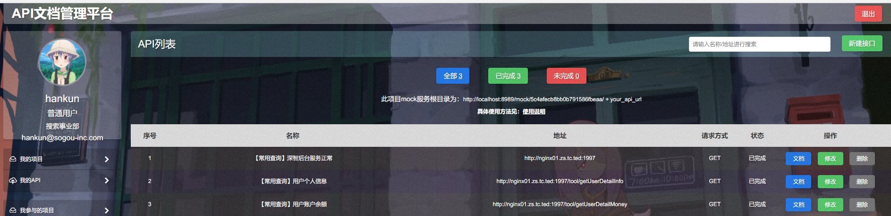

SApi即超级api文档管理系统
============================

## 演示地址

暂时没有外网虚拟机，有免费提供的可以联系我

## 项目原因

* 前端功能开发依赖于后端接口开发，没有提供接口前，会影响前端进度
* 项目开发时接口文档更新不及时，文档格式不一致，文档地址不统一，后端写完文档就懒得再改
* 接口未完成时前端调试困难，用本地数据模拟开发完成后修改成本大
...

## 项目提供的功能

* 根据项目管理接口，开发人员新建项目后再新建接口，书写接口文档，统一进行管理
* 根据项目成员进行权限控制，项目外的人只有查看而没有修改或删除权限
* 提供 `mock server` 服务，详情见下 `Mock Sever` 部分
* 提供 `http` 和 `https` 两种协议
* 提供简易版 `postman` 测试真实接口功能

## Mock Sever

在接口未完成时，本平台可以提供数据的 `mock` 服务。在新建接口时，定义好接口地址，接口参数，接口返回示例（可定义多个，勾选的示例即返回示例），根据本平台 `mock server` 的规则，请求接口，即可获取模拟数据。示例如下：

* 新建项目
* 进入接口列表页
* 可见到如下提示

* 定义接口 `url` `request params` `response example` ...
* 客户端直接请求 `mock 服务根目录 + api_url` ，以及定义好的请求方式和请求参数，即可返回模拟数据（根据所勾选示例）

```js
$.ajax({
	url: 'http://10.69.205.26:9090/mock/573e881c0a26da2c7e4023ab/http://10.69.205.26:9090/api/projects'
	type: 'get',
	data: {
		creator: '573e7b7d796923827d1ab00d',
		limit: 1,
		page: 2
	},
	success: function(res){
		// ...
	}
})
```

## 如何部署


### 环境要求

* Node@^4.4.2

* Npm@latest

* Mongodb@^3.0.4

### 部署流程

* 安装上述相关依赖

	**安装好数据库后，需新建名为 SApi 的库**

* clone 本项目源码

	`git clone https://github.com/ghohankawk/SApi`

* 配置相关信息

	配置相关参数，包括 
	
	`base.config.js` 中的端口信息，是否启用 ldap 验证，
	
	`db.config.js` 中的数据库信息，一个是 dev 数据库，一个是 production 数据库

* 安装项目依赖

	`npm i -d`

* 打包前端代码

    提供2中模式的打包前端代码

	`npm run dev`此打包是没有压缩过的，方便查看调试的

	`npm run build`此打包是用于生成，完全压缩的

* 启动应用

	`npm run offline`连接开发develop数据库运行此命令

	`npm run online`连接生产production数据库运行此命令

	当然，生产环境需要 pm2 等类似工具在后台运行应用

* 访问相关端口地址即可查看效果

   默认地址1，http:localhost:8989
   
   默认地址2，http:localhost:9090
   
## 问题反馈

如有问题可以直接加

QQ：457900833
   
   

